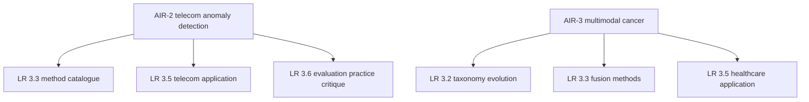

# Paper Breakdown Dossier — AIR-2 and AIR-3

Working document. Covers two papers only: **AIR-2** (Edozie et al. 2025, telecom anomaly detection) and **AIR-3** (Muneer et al. 2026, multimodal cancer data integration). Both are backed by our own full-text extraction notes in [`sources/`](../sources/) and by local PDFs in `papers/AIR/`, so every claim below is traceable to a page we can point at.

Companion documents: [`notes/landscape-report.md`](landscape-report.md) (the synthesis), [`paper/outline.md`](../paper/outline.md) (the section map), [`sources/AIR-2_artificial-intelligence-advances-in.md`](../sources/AIR-2_artificial-intelligence-advances-in.md), [`sources/AIR-3_from-classical-machine-learning.md`](../sources/AIR-3_from-classical-machine-learning.md), [`trackers/paper-tracker.md`](../trackers/paper-tracker.md).

---

## 0. How to use this dossier

Each paper gets four things:

1. **A narrative breakdown** — what it is, what it is about, what it does, what it finds, what it says, where its evidence is thin. Written as prose so you can *retell* it, not recite it.
2. **An integration map** — exactly which section of *our* paper it goes into, with sample sentences you can adapt and the citation number to use.
3. **A defence pack** — the numbers to memorise, the questions a supervisor plausibly asks, and the model answers.
4. **An honesty note** — what this paper does *not* say, so you never overclaim on a claim you cannot source.

**Citation numbering caveat.** This dossier uses the project's pool-ID numbering, where AIR-2 = `[17]` and AIR-3 = `[18]` (landscape-report convention). At submission the numbers must be re-keyed to **order of first appearance** in the final manuscript (per [`notes/requirements.md`](requirements.md) and the Springer Basic rule). Do not hard-code `[17]`/`[18]` into the final text — treat them as placeholders.

---

## 1. Where these two papers sit in the assignment

| | AIR-2 | AIR-3 |
|---|---|---|
| Journal / year | Artificial Intelligence Review 58(4), 2025 | Artificial Intelligence Review 59(4), 2026 |
| DOI | 10.1007/s10462-025-11108-x | 10.1007/s10462-026-11522-9 |
| Type | Review article (AIR documented exception) | Review article (AIR documented exception) |
| Length | 40 pp., 18,342 words | 69 pp., ~350 references |
| Citations at access | 86 | 16 |
| Access | Open access | Open access |
| Landscape branch | B3 — Applications and domains (security/telecom) | B4 — Foundation models and LLMs, and B3 — Applications (healthcare) |
| Tracker `Draft §` | §3.5 · §3.6 | §3.3 · §3.5 |
| Local PDF | `papers/AIR/AIR-2_Edozie_2025_TelecomAnomalyDetection.pdf` | `papers/AIR/AIR-3_Muneer_2026_MultimodalFoundationModelsCancer.pdf` |

**Why both are legitimately in the corpus despite being reviews.** AIR is the assignment's designated source journal *and* its format template; both papers are retained under the documented AIR review-article exception recorded in [`notes/selection-backing.md`](selection-backing.md) (interpretation 2), with research-only replacements (AIR-A6…A10) pre-verified if the exception is ever rejected. Neither is cited *because* it is a review — each is cited for a specific job it does that no other pool paper does (see §2.9 and §3.9).

---

## 2. AIR-2 — "Artificial intelligence advances in anomaly detection for telecom networks"

Edozie E, Shuaibu AN, Sadiq BO, John UK (2025). *Artificial Intelligence Review* 58(4). DOI: 10.1007/s10462-025-11108-x.

### 2.1 What it is

A **PRISMA-structured systematic review** of how anomaly detection in telecom networks moved from rule-based thresholds to machine learning and then to deep learning. It reports a screening funnel of **3,084 records gathered → 1,434 duplicates excluded → 1,258 removed on publication-year criteria → 232 excluded (inaccessible / irrelevant / insufficient quality) → 160 articles included** (p. 18, Fig. 5). Databases: Springer, IEEE, ScienceDirect, Google Scholar, arXiv (pp. 17–18).

It is a **catalogue plus a diagnosis**: the catalogue is the method landscape, the diagnosis is that the field's real blocker is *deployment*, not accuracy.

### 2.2 What it is about — the problem it exists to answer

Telecom operators run networks where faults, DDoS attacks, fraud and service degradation all present as *anomalies in enormous volumes of machine-generated data*. The paper's opening claim is blunt: **"Traditional methods of anomaly detection, which rely on rule-based systems, are no longer effective in today's fast-evolving telecom landscape."** (p. 1). Rule-based thresholds are described as unscalable, high in false positives and negatives, and **reactive only** — they fire after the damage, on rules a human wrote for conditions that have already changed (pp. 2, 4; Table 1 p. 5).

The story the paper tells is a **decade-long transition**, and it is the only pool paper with an explicit historical evolution timeline (Table 1, p. 5): 1960s manual thresholds → 1980s rules → statistical/ML methods → the big-data Hadoop/Spark era → 2020s deep learning. That timeline is the paper's most reusable artefact for our Introduction or §3.3 — it gives the review a periodisation that no other paper supplies.

### 2.3 What it does — method and scope

- **PRISMA review**, 160 included articles, no date range stated, no per-database counts, and — importantly — **no dual-screening or inter-coder agreement statistic reported** (p. 18). Contrast AIR-1, which reports Cohen's κ = 0.82. This is an evidence-quality asymmetry worth noticing.
- **Scope is telecom-specific**: 5G/6G, edge computing, IoT contexts. It is *not* a general anomaly-detection survey, and it never leaves the telecom operational framing.
- **It ran no experiments.** The authors state plainly: **"No datasets were generated or analysed during the current study."** (p. 33). Every number in it is a *reported* number from a reviewed paper.

### 2.4 What it finds

**Finding 1 — Deep learning dominates, and the reported quality clusters at 85–97%.** CNN/RNN/LSTM/autoencoders capture non-linear and temporal dependencies where k-NN, LOF and PCA struggle with scale and dimensionality (pp. 8, 13, 27). Sample reported accuracies (Table 4, p. 24): DeepAnT 91%, LSTM-AD 92%, LSTM-VAE 92%, MTAD-GAT 93%, MSCRED 91%, NumentaHTM 94%, Telemanom 90%, STAMP 90% recall, S-H-ESD 85%.

**Finding 2 — Accuracy is not free; there is a measurable accuracy-vs-latency trade-off** (Table 5, p. 26):

| Family | Reported accuracy | Reported latency | Scalability note |
|---|---|---|---|
| Autoencoders | 85–95% | 2,000–7,000 ms | — |
| LSTM | 80–95% | 1,000–5,000 ms | — |
| Isolation Forest | 80–90% | 100–400 ms | high scalability |
| XGBoost | 85–97% | 300–1,000 ms | — |

Read across the rows: the *most accurate* deep models are the *slowest*, and the fast classical ensembles give up only a few points. For a review about big data, this table is gold — it is a concrete statement that **velocity is paid for in accuracy**, which is exactly the kind of cross-cutting tension §3.6 is built to hold.

**Finding 3 — Unsupervised/reconstruction methods are the default, because labels are the bottleneck.** Telecom anomalies are scarce, rare and imbalanced; labelling them is expensive and often impossible in real time (pp. 8, 24, 30). So the field defaults to methods that learn "normal" and flag deviation.

**Finding 4 — Emerging techniques are diversifying the field**: GNNs/GATs/TGNs for topology and time-evolving graphs, transformers for long-range dependency, federated learning + edge AI for privacy/bandwidth/latency, self-supervised/meta/few-shot learning to cut label dependence, GAN/VAE for synthesising rare anomalies, XAI for transparency, RL and Bayesian neural networks for dynamics and uncertainty (Table 3, pp. 20–21; §5.1 pp. 19, 22).

**Finding 5 — Deployment, not accuracy, is the blocker.** GPU/TPU cost, cloud egress and storage cost, edge resource constraints and latency, 5G/6G-scale heterogeneity, model drift and the ongoing cost of retraining (pp. 29–32). Six recommendations close the paper (pp. 32–33): hybrids for accuracy *plus* explainability; real-time/scalable edge and distributed AI; better preprocessing; federated learning + edge AI for privacy; **standard benchmarks and evaluation metrics**; long-term self-adapting models.

### 2.5 What it says — the arguments, and the lines worth quoting

The paper's thesis: *the accuracy problem in telecom anomaly detection is largely solved in the lab; the unsolved problems are operational* — cost, latency, drift, label scarcity, and the absence of common benchmarks.

Quotable lines (with page):

- **"Traditional methods of anomaly detection, which rely on rule-based systems, are no longer effective in today's fast-evolving telecom landscape."** (p. 1) — the hook for the transition narrative.
- **"Following a thorough evaluation of 3084 articles gathered from multiple sources … 160 articles were selected for inclusion in the study."** (p. 18) — proves the PRISMA funnel when you cite the screening method.

### 2.6 Limitations the authors admit

§6.4 (pp. 29–32): computational limitations; model interpretation; data availability and quality; scalability; pre-/post-processing requirements; noisy imbalanced data with rare anomalies (p. 30); real-time processing straining on-premises infrastructure (pp. 29–30); model drift and continuous-retraining cost/disruption (p. 30); accuracy loss when scaling (p. 15). Plus the scope limit: **no datasets generated or analysed** (p. 33).

### 2.7 Limitations we see — the critical analysis our review adds

This is where our paper earns its Literature Review marks, because the assignment rewards *critique*, not summary.

1. **The performance numbers are aggregate and unattributed.** Tables 4–5 report accuracy ranges and latencies that are not tied to named datasets, code, or per-study conditions, and they are self-reported from the reviewed papers. They are *indicative, not reproducible*. Contrast [`TBD-5`](../sources/TBD-5_enhanced-approaches-for-anomaly.md), which reports per-method results on three named datasets (ECG5000, Credit Card Fraud, SMTP).
2. **No volume or velocity figures support the "big data" framing.** We searched for records/day, GB/TB, streams/sec — there are none. The Hadoop/Spark mention is historical only (Table 1, p. 5). This is the "framing, not substance" pattern our relevance audit already names.
3. **Not one public benchmark is named** — no KDD, NSL-KDD, CICIDS, NAB or SMD — and no operator data is used; the case studies are secondary citations (pp. 22–23).
4. **No LLM/foundation-model content at all**, which is a real thematic gap given [`TBD-2`](../sources/TBD-2_tsmllm-a-multimodal-large.md), [`TBD-3`](../sources/TBD-3_graphllm-boosting-graph-reasoning.md) and AIR-3 in the same corpus.
5. **Production sloppiness.** The reference list contains obvious year typos — "EncDec-AD (Malhotra et al. 1607)" (pp. 11, 24), "Torsk (Heim and Avery 1909)" (p. 10), "Michelucci 2201" (p. 11), "Parnami and Lee 2203" (p. 20). **Practical consequence: never borrow a citation from this paper without checking the original.**

### 2.8 Relevance to "Big Data with Machine Learning: A Review"

It is relevant on all three axes the assignment names:

- **Big data** — the subject is anomaly detection over continuous, high-volume, machine-generated network telemetry across 5G/6G, edge and IoT. Velocity and volume are the operational premise even where they are not quantified (which is itself our critique).
- **Machine learning** — it is a catalogue of ML for a real workload class, from Isolation Forest to GNNs and federated learning.
- **Cross-cutting value** — it is the **survey arm of the corpus's anomaly-detection vertical**: AIR-2 (survey) + [`TBD-5`](../sources/TBD-5_enhanced-approaches-for-anomaly.md) (streaming method) + [`JoBD-5`](../sources/JoBD-5_graph-neural-network-approach.md) (graph method). Three papers, three angles on one problem, is a ready-made **comparison** the LR can present — exactly the synthesis mode the brief demands.

### 2.9 The unique job it does in our paper

No other selected paper supplies: (a) a telecom-specific historical evolution timeline; (b) operator-facing deployment economics — GPU/TPU and cloud egress costs, model drift, retraining (pp. 29–32); (c) the only explicit accuracy-vs-latency trade-off table tied to anomaly detection. It also gives us a *contrast case*: a review that claims big-data scale without quantifying it, sitting next to TBD-5 which quantifies per-method results on named streaming datasets.

---

## 3. AIR-3 — "From classical machine learning to emerging foundation models: review on multimodal data integration for cancer research"

Muneer A, Waqas M, Saad MB, Showkatian E, Bandyopadhyay R, Xu H (2026). *Artificial Intelligence Review* 59(4). DOI: 10.1007/s10462-026-11522-9.

### 3.1 What it is

A **69-page PRISMA-based review with a complementary narrative scoping pass**, mapping how multimodal data integration in oncology evolved from classical machine learning through deep learning to biological foundation models. Screening funnel: **3,280 initial records → 332 unique screened → 111 full texts assessed → 54 core studies included** (Table 4), supplemented by a taxonomy of cancer foundation models across omics, pathology and radiology. Databases: PubMed, Google Scholar, arXiv, bioRxiv.

It is closer to a **reference work than a benchmark**: exhaustive, taxonomic, and consciously secondary.

### 3.2 What it is about — the problem it exists to answer

Cancer research generates **multimodal, high-dimensional, heterogeneous data** — genomics, transcriptomics, proteomics, digital histopathology whole-slide images (WSIs), radiology (CT/MRI/PET), and clinical health records — and the clinical questions (diagnosis, prognosis, risk stratification, personalised therapy selection) require *fusing* those modalities rather than analysing any one in isolation. The paper's framing device is that **"big data + ML" in this domain means heterogeneity and dimensionality, not just volume**: gigapixel WSIs, tens of thousands of molecular dimensions, single-cell datasets in the tens of millions of cells (scGPT >33M cells; Nicheformer 110M cells; OmniCLIP 2.2M paired tissue images). That reframing is directly usable in our review's central argument that heterogeneity has become the new scale.

### 3.3 What it does — method, and its two taxonomies

**Method.** Systematic PRISMA 2020 protocol plus a narrative scoping review for preprints (the paper is explicit that preprints needed a non-systematic pass — a real methodological caveat).

**Taxonomy 1 — the three-generation evolution of the methods:**

| Generation | Representative methods | What changed |
|---|---|---|
| Classical ML | SVM, Random Forest, XGBoost, Canonical Correlation Analysis, multi-view kernel learning, sparse representation | hand-engineered features; shallow models |
| Deep learning | CNNs (ResNet, DenseNet) for pathology/radiology; Autoencoders/VAE for multi-omics; GNNs and hypergraphs for protein–protein interaction and gene-regulatory networks; cross-modal attention/transformers | learned representations; graph structure; cross-modal attention |
| Foundation models | scGPT (single-cell transformer), Nicheformer (spatial transcriptomics), OmniCLIP (WSI + spatial transcript via CLIP-style dual encoders), GET (regulatory grammar), MolFM (molecules + text) | self-supervised/contrastive pretraining; zero- and few-shot transfer |

**Taxonomy 2 — the two-tiered fusion framework (the paper's signature contribution):**

- **Tier 1 — timing of integration.** *Early fusion* (concatenate inputs): simple, models cross-modal features, but suffers the curse of dimensionality and fails on missing modalities. *Intermediate fusion* (shared latent space): most robust, less biologically interpretable. *Late fusion* (decision-level ensembling): tolerates missing/unpaired data, but misses fine-grained cross-modal synergy.
- **Tier 2 — algorithmic strategy.** Hierarchical modelling (aligned to biological dogma: DNA → RNA → protein), biological network/graph methods, attention-based fusion, multi-view contrastive learning, correlation-based methods.

### 3.4 What it finds

1. **Intermediate and attention-based fusion outperform early concatenation and late voting** in survival and metastasis prediction, because they learn joint cross-modal latent distributions (p. 16 comparative appraisal).
2. **Foundation models enable zero-shot and few-shot transfer** to rare cancers where labelled cohorts are critically small — the concrete payoff of pretraining (pp. 31–44).
3. **The translational/evidentiary gap is vast:** more than **90% of current cancer-AI publications rely on retrospective, single-centre public cohorts** (e.g. TCGA); prospective randomised trials, real-world utility evaluations and FDA/CE approvals for multimodal models are **practically absent** (pp. 30–31).

Finding 3 is the single most quotable *cross-cutting* result in the AIR set: it is a review telling us that the field's own evidence base is not yet clinical-grade. It pairs with AIR-5's reproducibility audit and gives our §3.6 a two-source claim instead of an assertion.

### 3.5 What it says — the arguments

The paper's thesis: *the algorithmic frontier has moved to foundation models and multimodal fusion, but the field's bottleneck is no longer modelling — it is data harmonisation, compute, interpretability, and the absence of prospective validation.* In other words, the same operational-blocker argument AIR-2 makes for telecom, made for oncology.

Quotable lines (with page):

- **"The performance, reliability, and ultimate clinical utility of any AI model are inextricably bound to the fidelity, structure, and integrity of the data upon which it is trained. The most sophisticated algorithm cannot overcome the limitations of flawed or poorly harmonized inputs."** (p. 46) — the data-quality thesis statement; usable in §3.6 or the Conclusion.
- **"Bridging this gap will require prospective impact evaluations, integration of multimodal FMs into clinical decision-support tools, and formal assessment of how their use affects survival, toxicity burden, time-to-diagnosis, and healthcare efficiency at the system level."** (p. 31) — the translational-gap argument.

### 3.6 Limitations the authors admit

Extreme data heterogeneity and missing-modality rates in real clinical workflows; lack of standardised preprocessing pipelines across institutions; high compute and memory barriers preventing hospital deployment; deep models lacking mechanistic biological interpretability; absence of prospective validation and health-economic assessment (pp. 29–31, 46–53).

### 3.7 Limitations we see

1. **It is an encyclopedia, not a benchmark.** 69 pages and ~350 references: it *reports* secondary performance metrics without standardising evaluation seeds or hardware costs across the surveyed models, so its comparisons are indicative rather than reproducible.
2. **Unharmonised metrics.** Because models are compared across different cohorts and protocols, the "X outperforms Y" claims are directional, not controlled.
3. **Oncology-specific framing** limits direct transferability to non-biological big-data domains without abstraction — a scope caveat our review must carry, not hide.
4. **It is a secondary source throughout** — no primary data, no experiments of its own.

### 3.8 Relevance to "Big Data with Machine Learning: A Review"

- **Big data** — the *definitional* case that big data is now heterogeneous and high-dimensional rather than merely voluminous: multimodal, multi-scale, multi-institution.
- **Machine learning** — it is a full methodological arc from SVM/RF to foundation models, which makes it the corpus's clearest statement of the field's trajectory.
- **Cross-cutting value** — it supplies the healthcare application anchor *and* the foundation-model anchor, and it explicitly **contradicts** the assumption (visible in benchmark-focused papers such as [`JoBD-3`](../sources/JoBD-3_advancing-multimodal-emotion-recognition.md)) that increasing model-stack complexity equals real-world utility: AIR-3 shows complexity often *degrades* clinical reproducibility (pp. 29–31). A named contradiction between two pool papers is a first-class Literature Review asset.

### 3.9 The unique job it does in our paper

It is the only pool paper that supplies: (a) a **formal two-tiered fusion taxonomy** (timing vs algorithmic strategy); (b) a **catalogue of biological foundation models** with pretraining scale (scGPT >33M cells; Nicheformer 110M cells; OmniCLIP 2.2M paired images); (c) the quantified **translational gap** (>90% retrospective, near-zero prospective). It bridges the abstract foundation-model discussion in [`AIR-1`](../sources/AIR-1_agentic-ai-a-comprehensive.md) and [`TBD-2`](../sources/TBD-2_tsmllm-a-multimodal-large.md) down to concrete biological modalities.

---

## 4. The two side by side — the synthesis the LR actually wants

| Dimension | AIR-2 | AIR-3 |
|---|---|---|
| Domain | Telecom network operations | Oncology / clinical research |
| Central tension | Accuracy vs latency/cost; deployment is the blocker | Algorithmic frontier vs translational validation gap |
| Evidence standard | PRISMA, 160 included, no κ reported | PRISMA + scoping, 54 included |
| Big-data meaning | Volume/velocity of network telemetry (asserted, unquantified) | Heterogeneity/dimensionality (quantified: 110M cells, gigapixel WSIs) |
| Runs experiments? | No (p. 33) | No (secondary throughout) |
| Names benchmarks? | No public benchmark named | Yes — TCGA, GEO, METABRIC, CPTAC, Visium, CCLE, ICGC, SEER, MIMIC |
| Shared conclusion | Deployment, not accuracy, is the real constraint | Validation and harmonisation, not modelling, is the real constraint |
| Shared weakness | Unharmonised, unattributed performance numbers | Unharmonised metrics across cohorts |

**The join between them is our thesis.** Both papers independently arrive at the same structural conclusion from opposite ends of the corpus — *the model is no longer the hard part; the data, the platform and the proof are*. That is the argument our §3.6 cross-cutting section and the Conclusion should make, and these two papers let us make it with two citations instead of one assertion. It is precisely the kind of "compare and critically analyse" the 10% Literature Review component rewards.

---

## 5. How to add each paper to the assignment

### 5.1 AIR-2 → integration map

| Target | What AIR-2 contributes | How to write it |
|---|---|---|
| **§3.3 Scalable ML methods** | Its method catalogue: classical ensembles (Isolation Forest, XGBoost) vs deep reconstruction (autoencoders, LSTM) vs emerging (GNN, transformer, federated) | Cite as the *taxonomy source* for the anomaly-detection method family; pair with TBD-5 and JoBD-5 |
| **§3.5 Applications & domains** | Telecom as a domain: 5G/6G, edge, IoT operational setting | Open the domain paragraph with the rule-based-is-obsolete line |
| **§3.6 Cross-cutting analysis** | The accuracy-vs-latency table and the "no named benchmark" critique | Use as the concrete example of evaluation-practice weakness |
| **Table 1** | One row (data in the tracker's Table 1 row) | Domain = telecom anomaly detection; method = CNN/RNN/LSTM/AE/GNN/federated; platform = none used, Hadoop/Spark historical only; dataset = none analysed; contribution = PRISMA review of 160 papers charting the rule-based → deep-learning transition |
| **Table 2 (theme × paper)** | Row: AIR-2 | Mark it under "applications" and "cross-cutting" |
| **Fig. 3 (distribution)** | Counts toward 2025 and toward the security/anomaly-detection theme | — |

**Sample sentences you can adapt** (numbers are pool-ID placeholders — re-key at submission):

- *Transition narrative:* "The shift from rule-based to learned anomaly detection is itself documented: [17] argues that threshold and rule-based systems 'are no longer effective' in modern telecom networks and periodises the transition from 1960s manual thresholds through the big-data Hadoop–Spark era to 2020s deep learning."
- *The trade-off:* "Accuracy at scale is not free: reported detection quality clusters at 85–97%, but the most accurate autoencoder-based detectors incur latencies of 2,000–7,000 ms against 100–400 ms for the far cheaper Isolation Forest [17]."
- *The critique (ours):* "Yet these figures are reported as unattributed ranges rather than evaluations on named datasets, and the paper names no public benchmark — illustrating the evaluation-fragmentation problem the corpus documents about itself."

### 5.2 AIR-3 → integration map

| Target | What AIR-3 contributes | How to write it |
|---|---|---|
| **§3.2 Taxonomy** | The three-generation evolution (classical → deep → foundation) as an organising axis | Cite as the source of the generational axis in our Fig. 2 taxonomy |
| **§3.3 Scalable ML methods** | The two-tiered fusion taxonomy (timing + algorithmic strategy) | Present as a design-choice framework; compare against TBD-4's local/global fusion |
| **§3.5 Applications & domains** | Healthcare/oncology as the flagship multimodal domain | Anchor the healthcare paragraph on heterogeneity-as-scale |
| **§3.6 Cross-cutting analysis** | The >90%-retrospective translational gap; contradicted-assumption claim | Pair with AIR-5's reproducibility audit as a two-source claim |
| **Table 1** | One row | Domain = multimodal cancer research; method = SVM/RF → CNN/AE/GNN/attention → foundation models; platform = none (GPU clusters discussed); dataset = none primary, PRISMA of 54 studies; contribution = 69-page classification of fusion strategies and cancer foundation models, identifying the translational evidentiary gap |
| **Table 2** | Row: AIR-3 | Mark under "foundation models" and "applications" |
| **Fig. 3** | Counts toward 2026, healthcare theme, foundation-model branch | — |

**Sample sentences you can adapt:**

- *Heterogeneity as scale:* "In this corpus 'big data' is frequently a statement about heterogeneity rather than volume: [18] frames multimodal cancer research as fusing gigapixel histopathology, tens of thousands of molecular dimensions and multi-institutional clinical records, with pretrained models spanning single-cell corpora of 33–110 million cells."
- *The fusion finding:* "Where fusion is performed matters: intermediate and attention-based fusion outperform early concatenation and late voting for survival and metastasis prediction, at the cost of biological interpretability [18]."
- *The contradiction (our synthesis):* "Against the implicit assumption that deeper stacks yield better outcomes, [18] demonstrates that added model complexity often degrades clinical reproducibility and fails prospective validation — over 90% of the surveyed work rests on retrospective, single-centre cohorts."

### 5.3 What these two do for the Tables & Figures component (3%)

Both feed **Table 1** (master comparison — the backbone table) and **Table 2** (theme × paper). Optionally, they jointly justify a **small dedicated comparison table** on *evaluation practice* (benchmarks named? volume quantified? experiments run?) — a table that turns our §3.6 critique into a visual, which is exactly what the Tables and Figures marks reward. AIR-3 also supplies the healthcare/2026 counts for **Fig. 3**.

---

## 6. Defence pack — how to prove you read it

The supervisor's test is rarely "summarise the paper". It is *"tell me something only a reader would know"*. Three things make you unfakeable: **a page-specific number, a quirk of the paper's own method, and a limitation the authors admit.** Below is a supply of all three for each paper.

### 6.1 The 60-second self-brief (say this if put on the spot)

**AIR-2.** "It is a PRISMA review of telecom-network anomaly detection — 3,084 records screened down to 160 included. Its argument is that rule-based detection is obsolete and deep learning now dominates at 85–97% reported accuracy, but that accuracy is bought with latency — autoencoders take 2,000 to 7,000 milliseconds against 100 to 400 for Isolation Forest. Its real contribution to our review is that it names deployment cost, model drift and missing benchmarks as the blockers, not model quality — and it openly states it analysed no datasets itself."

**AIR-3.** "It is a 69-page PRISMA review of multimodal data integration in cancer research — 3,280 records down to 54 core studies — tracing classical ML through deep learning to biological foundation models like scGPT and Nicheformer. Its signature contribution is a two-tiered fusion taxonomy: timing of fusion, and algorithmic strategy. Its headline finding for us is the translational gap — over 90% of the surveyed work is retrospective and single-centre, with essentially no prospective trials or FDA clearances."

### 6.2 Numbers to memorise (these are your proof of reading)

| Paper | Number | What it is |
|---|---|---|
| AIR-2 | 3,084 → 160 | records screened → articles included |
| AIR-2 | 85–97% | reported detection accuracy band |
| AIR-2 | 2,000–7,000 ms vs 100–400 ms | autoencoder latency vs Isolation Forest |
| AIR-2 | "No datasets were generated or analysed" (p. 33) | the scope admission |
| AIR-3 | 3,280 → 54 | records screened → core studies included |
| AIR-3 | >90% retrospective, single-centre | the translational gap |
| AIR-3 | 33M / 110M cells | scGPT vs Nicheformer pretraining scale |
| AIR-3 | early / intermediate / late | the Tier-1 fusion taxonomy |

### 6.3 Likely supervisor questions, with model answers

**Q: "These are reviews, not research papers — why are they in a review of research papers?"**
A: "They are from Artificial Intelligence Review, which the assignment designates as one of the four source journals and as the format template — AIR is a review-designated journal, so its 2025–26 output is predominantly review articles. We retained five AIR articles as a documented exception and we hold five pre-verified original-research AIR articles as drop-in replacements if you would prefer strict original-research-only. All fifteen of our other selections are original research." *(Cite [`notes/selection-backing.md`](selection-backing.md), interpretation 2, and AIR-A6…A10.)*

**Q: "What did AIR-2 actually find that's new?"**
A: "Not a new algorithm — its contribution is diagnostic. It shows the field's reported accuracy has plateaued at 85–97% but that the cost structure is the real constraint: the most accurate detectors are the slowest, and the fast classical ones lose only a few points. And it identifies the absence of standard benchmarks as the reason results aren't comparable."

**Q: "Give me one concrete number from AIR-2."**
A: "Its screening funnel: 3,084 articles gathered, 160 included — that's from p. 18. And its accuracy-vs-latency table on p. 26: autoencoders 85–95% at 2,000–7,000 ms versus Isolation Forest 80–90% at 100–400 ms."

**Q: "What is AIR-3's actual contribution?"**
A: "Two taxonomies. First, the generational evolution from classical ML to foundation models. Second — and this is the unique one — a two-tiered fusion taxonomy that separates *when* you fuse (early, intermediate, late) from *how* you fuse (hierarchical, graph-based, attention-based, contrastive). And it quantifies the translational gap."

**Q: "What are the weaknesses of these two papers?"**
A: "AIR-2's performance numbers are unattributed aggregate ranges, it names no public benchmark, it never quantifies the 'big data' it claims, and it has no LLM coverage. Its reference list even has year typos — 'Malhotra et al. 1607' — so you can't borrow citations from it unchecked. AIR-3 is a 69-page encyclopedia with roughly 350 references that reports secondary metrics without harmonising evaluation seeds or hardware, and it's oncology-specific, so it doesn't generalise without abstraction."

**Q: "How do they relate to each other?"**
A: "They're opposite ends of the corpus arriving at the same structural conclusion: in telecom, the blocker is deployment and latency; in oncology, the blocker is validation and data harmonisation. Neither says the model is the hard part. That convergence is the thesis of our cross-cutting section."

**Q: "Where in your paper does each appear?"**
A: "AIR-2 anchors the telecom application paragraph and the evaluation-practice critique — §3.5 and §3.6. AIR-3 anchors the healthcare application paragraph and supplies the generational axis for our taxonomy figure — §3.2, §3.3, §3.5, and it feeds the cross-cutting gap in §3.6."

### 6.4 Traps — things that would expose overclaiming (avoid all of these)

- **Do not say AIR-2 proved a big-data platform works.** It used none; its Hadoop/Spark mention is historical (Table 1, p. 5). It states it analysed no datasets (p. 33).
- **Do not present AIR-2's 85–97% as evaluated on a named dataset.** Nothing is named; no KDD/CICIDS/NAB/SMD.
- **Do not cite a reference you found *inside* AIR-2 without checking it** — the year typos mean the bibliography is unreliable at the entry level.
- **Do not claim AIR-3 ran experiments or produced data.** It is secondary throughout; every number is second-hand.
- **Do not call either paper "systematic" without qualification for AIR-3** — it combines PRISMA with a narrative scoping pass over preprints, which the authors disclose.
- **Do not cite AIR-2 for the LLM/foundation-model trend** — it has none. Use TBD-2/TBD-3/AIR-3 there.

### 6.5 Artefacts that prove you read it

If challenged, point at the record, not your memory:

1. The **extraction note** in [`sources/AIR-2_artificial-intelligence-advances-in.md`](../sources/AIR-2_artificial-intelligence-advances-in.md) / [`sources/AIR-3_from-classical-machine-learning.md`](../sources/AIR-3_from-classical-machine-learning.md) — bibliographic data, the filled "Synthesis hooks", the reading-triage list of exactly which pages carry the value.
2. The **local PDF** in `papers/AIR/` — you can open it to a quoted page on demand.
3. The **claim-to-evidence ledger** (R2 in [`trackers/paper-tracker.md`](../trackers/paper-tracker.md)) — the row where the number, its page, and who checked it are recorded. A verified claim with a second checker is the strongest possible answer to "did you actually read it".
4. A **page-specific quote** — e.g. AIR-2 p. 1 and p. 18; AIR-3 p. 46 and p. 31. Naming the page is what separates a reader from a summariser.

---

## 7. Pre-emptive checklist — do this before you are asked

- [ ] Open both PDFs and confirm the four quoted lines sit on the stated pages (p. 1 and p. 18 for AIR-2; p. 46 and p. 31 for AIR-3).
- [ ] Re-verify the two screening funnels (3,084 → 160; 3,280 → 54) against the PDF figures.
- [ ] Fill the remaining "Synthesis hooks" fields in both `sources/` notes with *our* paper's section codes, not the generic template wording.
- [ ] Add one row per paper to the R2 claim-to-evidence ledger for every number that reaches the manuscript (accuracy band, latency ranges, funnel counts, >90% gap).
- [ ] Decide the final citation numbers at assembly (pool-ID `[17]`/`[18]` are placeholders only) and confirm every `[n]` resolves both ways.
- [ ] Draft the two "sample sentences" above into `paper/sections/` in the voice of the surrounding paragraphs — do not paste them verbatim if the tone clashes.

---

*Scope note: this dossier deliberately covers only AIR-2 and AIR-3, per instruction. AIR-1, AIR-4 and AIR-5 have full-text-backed notes and can be given the same treatment on request; the remaining fifteen papers are abstract-level or title-level today, so any "breakdown" of them before the team reads the full texts would be reconstruction rather than reading.*
