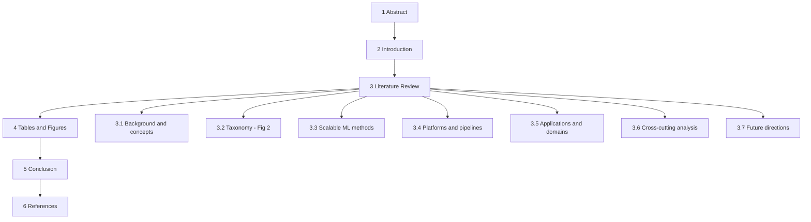

# Thesis and Structure — "Big Data with Machine Learning: A Review"

*Planning design document. Produced 2026-09-22 by an IDEA-EVALUATION + STRUCTURE-PLANNING subtask. Scope: design only — no manuscript prose, no LaTeX, no `.bib`. Every claim below traces to `sources/*.md`, `trackers/paper-tracker.md` (R1 master table, R2 claim ledger C-01…C-21, branch map), `notes/landscape-report.md`, `paper/outline.md`, `notes/requirements.md`, `notes/recon-report.md`, or `notes/air-format-spec.md`. Nothing is inferred beyond those files.*

Companion document: [`notes/writing-plan.md`](notes/writing-plan.md) (writing sequence, per-section step specs, citation order, tables/figures needs, risks).

---

## 0. How the idea-evaluator skill was loaded and adapted

**Skill loaded:** `idea-evaluator` (`C:\Users\User\.agents\skills\idea-evaluator\SKILL.md`), read in full. Its core procedure was followed (Step 1 first impression → Step 2 fatal-flaws early gate → Step 3 lifecycle/capability → Step 4 five-dimension scoring → Step 5 paradigm-shift probe → Step 6 feasibility → Step 7 integrity gate → Step 8 verdict). Linked `references/*.md` files were **not** read: the skill's own progressive-disclosure rule allows reading the minimum needed, and the substantive content needed here (five dimensions, fatal flaws, lifecycle, paradigm probe) is summarised inline in `SKILL.md` and was adapted directly.

### Where and why the skill is adapted

The skill's five dimensions (Higher / Faster / Stronger / Cheaper / Broader), its idea-lifecycle and capability matching, and its fatal-flaws audit were written for a **novel research idea** — a mechanism, method, benchmark, or empirical claim that must be validated by new experiments. The object being evaluated here is different in kind: the **organizing thesis of a literature review**. A review does not introduce a mechanism; it introduces a **claim about a body of work**, and its quality is judged by whether that claim (i) rises above paper-by-paper summary, (ii) generalizes across the corpus, (iii) is defensible from available evidence, and (iv) is achievable with the evidence the team actually holds.

| Skill element | Original target | Adapted target for a review thesis | Rationale |
|---|---|---|---|
| **Higher** | effectiveness/accuracy gain over prior methods | **Level of analysis**: does the thesis state a claim *above* the 20 papers, or merely reorganise them? | The review's "gain" is analytical elevation, not accuracy. |
| **Faster** | efficiency/cost reduction | **Structural productivity**: does the thesis generate the section structure and make the Literature Review tractable to draft? | A good review thesis is one from which the outline falls out. |
| **Stronger** | robustness/generalization of a method | **Defensibility**: can the thesis be asserted without overclaiming, given abstract-level evidence and missing abstracts? | The review's failure mode is overclaiming, not brittleness. |
| **Cheaper** | data/annotation cost | **Evidence cost**: is the thesis supportable with the notes/R2 ledger already in hand? | The binding constraint is retrievable evidence, not compute. |
| **Broader** | cross-domain transplantation | **Cross-journal generalization**: does the thesis hold across all four journals (TBD, BDR, JoBD, AIR) or only one? | A thesis true for only one journal is a paragraph, not a review spine. |
| **Idea lifecycle** | six-category product lifecycle vs student hours | **Review lifecycle**: corpus frozen (rev 3, 2026-09-15) → deadline 2026-09-27 → deliverable is fixed by assignment | The review has no "market"; it has a fixed brief and a fixed date. |
| **Capability match** | student skill vs idea demands | **Team capability vs brief**: 8 members, 20 papers, 14 fully readable, 6 paywalled, 3 of those with no abstract | Feasibility is an access/evidence question. |
| **Fatal-flaws audit** | ten flaws for novel ideas | **Re-audited around review-specific risks**: the AIR review-article exception, missing BDR abstracts, and the "big data" framing instability (full list in §2) | These are the failure modes that can sink *this* deliverable. |

**Skill short-circuit note.** The skill's short-circuit rule (emit Reject and Pivot if any CRITICAL flaw is present) was applied: **no CRITICAL flaw was found**, so the full evaluation proceeds.

---

## 1. First impression and paper-type positioning (skill Step 1)

- **Paper type (adapted):** the deliverable is an **AI Review Paper** (a *literature review*), not a Novel Problem / Novel Method / New Setting article. The "idea" under evaluation is its organizing thesis.
- **One-sentence story:** *Across the 2025–2026 output of four big-data/ML journals, machine learning on big data has shifted from learning on more data to learning under constraints — privacy, platform, and proof — and the corpus's own evidence shows those constraints, not accuracy, are now the binding limits.*
- **Is the story compelling in one sentence?** Yes, and it is the thesis `notes/landscape-report.md` §11 already converges on ("less about learning from more data than about learning under constraints — privacy, platforms, and proof"). The evaluation below tests whether that convergence is the *best* available thesis or merely the first.

---

## 2. Fatal-flaws audit (skill Step 2, early gate — adapted)

The skill asks for **at most two** fatal flaws, each with a detection rule and a concrete defense. The audit below is run against the *review thesis*, not a research mechanism.

| # | Flaw (review-specific) | Severity | Detection rule | Defense |
|---|---|---|---|---|
| **F1** | **The AIR reviews-are-an-exception risk.** All 5 AIR selections are review articles, and `notes/requirements.md` L24 records the supervisor's clarification that "research papers" means *original research articles*, with AIR's five kept as a **documented exception**. If the exception is rejected, a fifth of the corpus (and the anchor of §3.3–§3.6 syntheses) changes. | **MAJOR** (not CRITICAL: the exception is already documented and approved, and swaps AIR-A6…A10 are pre-verified) | A thesis that depends on the AIR reviews' *synthesis* content rather than on their *classifiable position* would break under a swap. | Frame the AIR reviews as **synthesis anchors** whose role is to frame each §3.x argument, and keep every load-bearing empirical claim on a TBD/BDR/JoBD research paper. State the exception explicitly in the Introduction scope paragraph. If rejected, promote AIR-A6…A10 (per `notes/recon-report.md` §8.6) — but never substitute silently. |
| **F2** | **Evidence thinness: three BDR papers have no retrievable abstract** (BDR-3, BDR-4, BDR-5 — `sources/BDR-3/4/5`, "abstract NOT AVAILABLE"), and four TBD papers are paywalled with abstract-level backing only (TBD-1, TBD-2, TBD-3, TBD-5). A thesis that needs those papers' numbers cannot be supported. | **MAJOR** (recoverable: BDR-4 has a free SSRN preprint; TBD-A5/BDR-A1/BDR-A2 are designated OA swaps) | Any draft sentence attaching a **number** to BDR-3/4/5 or to a paywalled TBD abstract violates the R2 ledger rule ("Abstract-only backing is fine for a description, never for a number") and the "no fabrication" rule. | Ground the thesis on **patterns and classifications**, not on those papers' magnitudes. Describe BDR-3/4/5 at title/branch level (they already sit cleanly: Spark cluster, financial graph, classical regression). Mark them `†`-equivalent in draft and require full-text verification before any scalar claim. This is why R2 C-13/C-14 exist. |

*No CRITICAL flaw found → proceed to scoring (skill Step 3 onward).*

**Additional non-fatal risks** (carried into the fatal-flaws discussion below and audited in §4, because the task explicitly requires them):

- **F-FRAMING — the "big data" framing is often domain-data variety, not distributed scale.** This is not a flaw in the *review*; it is the review's most important *finding*. R2 **C-07** documents it: JoBD-1 trains 30,000 images on a single Kaggle GPU with no Spark/Hadoop (p.20); JoBD-3 uses ONNX Runtime on ~25k utterances (p.16); JoBD-2 uses 10 simulated clients with no Spark/Hadoop (p.16). R2 **C-13** adds that scalability claims are "frequently architectural rather than empirically measured" (TBD-1, BDR-2, JoBD-1). The thesis must *name* this instability rather than inherit it.
- **F-OVERCLAIM — negative/absence claims from a curated corpus.** `notes/landscape-report.md` §2 states theme proportions are "curated, not raw field proportions." So "no paper addresses X" (R2 **C-21**; landscape §9–§10) is a claim about *20 verified papers*, not about the field, and must be scoped as such.
- **F-NUMBERS — anomalously high reported figures.** JoBD-3's 99.82%/99.81% (p.53) and TBD-5's threshold-style ">94%" (abstract) cannot be quoted as like-for-like SOTA (R2 **C-09**). The thesis must treat these as *reporting-practice* evidence, not capability evidence.
- **F-THESE — the "constraints" thesis risks reading as trivially true.** Defense: it earns non-triviality only where it is coupled to the corpus's *own* evidence — the reproducibility audit (R2 C-06) and the privacy–scale tension (R2 C-15). §5 scores this explicitly.

---

## 3. Lifecycle and capability match (skill Step 3, adapted)

| Aspect | Input | Assessment |
|---|---|---|
| Idea category (adapted) | Review of a frozen 20-paper corpus; bridges learning methods, platforms, and governance | **Data-Intensive + Cross-Disciplinary** — the closest of the six original categories; the "product" is a synthesis of already-extracted evidence |
| Review lifecycle | Corpus locked rev 3 on 2026-09-15; deadline 2026-09-27; target freeze 2026-09-26 (`trackers/paper-tracker.md` L31) | **~5 days to drafting+freeze** — extremely short; the thesis must be one the evidence already supports |
| Team capability | 8 members; Phase B roles assigned (`notes/recon-report.md` §2.4: integration editor, theme leads 2/3/5, T&F=6, cross-cutting=4, intro+conclusion=7, formatting+refs+abstract=8) | Structured and matched to the fixed components |
| Evidence available | 14 OA + fully note-backed (AIR-1..5, JoBD-1..5, BDR-1/2/4, TBD-4) · 4 paywalled abstract-level (TBD-1/2/3/5) · 3 no-abstract (BDR-3/4/5) | **Yellow** — green for 14 papers, red for the 6-paper paywalled/thin cluster; 17/20 readings complete per R1 |
| Fit | ... | **Yellow** — feasible if the thesis leans on patterns (classification/agreement/contradiction) rather than on the thin cluster's numbers |

**Mismatch flag:** the lifecycle is *shorter* than a thesis-first workflow would like (e.g., "run experiments to test the claim"). The recovery is the review-native one: the thesis is **tested by internal consistency across the corpus**, not by new experiments — which is why the "Stronger/defensibility" and "Broader/cross-journal" dimensions below carry the most weight.

---

## 4. Candidate organizing theses and their evaluation (skill Step 4, adapted)

### 4.1 The candidates, stated in one sentence each

- **T1 — Constraint thesis.** *In the 2025–2026 output of these four journals, big-data machine learning is less about learning from more data than about learning under constraints — privacy, platform (streaming/compute), and proof (evaluation and reproducibility).* (This is `notes/landscape-report.md` §11's explicit thesis.)
- **T2 — Two-tensions thesis.** *The corpus is pulled between a scale-maximizing program that assumes capability comes from centralizing and pretraining on everything, and a privacy-preserving program whose premise is that data cannot be centralized; simultaneously, its evaluation practice is fragmented and largely unverifiable.*
- **T3 — Heterogeneity thesis.** *In this corpus "big data" means heterogeneity and structure — multimodal, graph-structured, multi-source, streaming — more often than it means volume; volume alone appears in no title.* (`notes/landscape-report.md` §9, "heterogeneity is the new scale".)
- **T4 — Evidence-gap thesis.** *The corpus shows an unmistakable architectural shift from classical to deep/foundation-model methods, but the associated scalability and performance claims systematically outrun the measurements that would verify them.*

### 4.2 Scoring (adapted dimensions; start each at 5 and justify movement — skill scoring discipline)

| Dimension (adapted) | T1 Constraint | T2 Two-tensions | T3 Heterogeneity | T4 Evidence-gap | Evidence for the movement |
|---|---|---|---|---|---|
| **Higher** — level of analysis above a paper-by-paper summary | **9** | **8** | **7** | **8** | T1 subsumes T2 and T3 into one claim and is the only candidate that also dictates the §3.x structure (methods→platforms→applications→cross-cutting). T2 is analytic but two-headed. T3 is a definitional reframing — strong and crisp but narrow. T4 is a meta-claim about method rather than about the field. |
| **Faster** — structural productivity (does the outline fall out?) | **9** | **7** | **6** | **7** | T1 maps 1:1 onto the tracker's §3.3–§3.6 and the B1–B5 branch map. T2 needs a bespoke contrast structure. T3 needs almost no structure (it is one section). T4 drives §3.6 but not §3.3–§3.5. |
| **Stronger** — defensibility without overclaiming | **7** | **8** | **9** | **6** | T1 is broad and therefore risks overclaiming; it is only defensible when bound to the corpus's own evidence (C-06, C-15). T2's two tensions each have named backing (C-15 for privacy–scale; C-06/C-19 for evaluation). T3 is the safest: it is a descriptive reframing, supported by C-07/C-08/C-11/C-12. T4 is the riskiest — it generalises a reporting critique (C-06, C-09, C-13) that rests largely on one audit (AIR-5) plus abstract gaps. |
| **Cheaper** — evidence cost | **8** | **8** | **9** | **5** | T1/T2 are supportable from the R2 ledger as it stands (C-04, C-05, C-06, C-13, C-14, C-15, C-16, C-19). T3 is almost free (corpus-wide title/abstract facts). T4 needs numbers that several papers do not supply (BDR-3/4/5 have no abstract; 4 TBD paywalled) — high evidence cost. |
| **Broader** — holds across all four journals | **9** | **8** | **8** | **7** | T1 is visible in every journal: **TBD** (TBD-1 explanation cost, TBD-5 streaming, TBD-3 context reduction), **BDR** (BDR-2 FL cost, BDR-3 Spark, BDR-5 classical scaling), **JoBD** (JoBD-2 privacy/DP, JoBD-4 streaming, JoBD-5 overhead admission), **AIR** (AIR-5 reproducibility audit, AIR-4 governance, AIR-1 compute warning). T2 is well-spread but its second half leans on AIR-5. T3 is corpus-wide. T4 is strongest in TBD/AIR and thin in BDR/JoBD. |

**Highest-ceiling dimensions to emphasize in the paper (skill Step 4 output):** **Higher** and **Broader** for T1; **Stronger** and **Cheaper** for T3.

### 4.3 Paradigm-shift probe (skill Step 5, adapted to a review)

| Probe | Yes/No | Rationale |
|---|---|---|
| First Principles — challenges a hidden assumption | **Yes** | T1/T3 challenge the field's unspoken equation of "big data" with *volume*; the corpus's own titles favour heterogeneity and constraint (`notes/landscape-report.md` §9). |
| Elephant in the Room — names what everyone sees but avoids | **Yes** | T2's evaluative half names the reproducibility/verification deficit (C-06) that the citation race rewards ignoring (landscape §9: AIR-1 has 134 citations; AIR-5, the only audit, has 0). |
| Technology Cycle — rides a shift | **Yes** | C-01/C-02 record the classical→deep→LLM/foundation-model shift; the review is timely because the LLM wave (TBD-2, TBD-3) is under a year old. |
| Hamming's Rule — would the field change if this were solved? | **Partial** | If constraint-management (privacy, platform, proof) were solved, "big data + ML" would look very different; but a *review* does not itself solve it. |
| **Disruptive potential** | **Possible** | Three of four probes positive. For a literature review, "possible" is the ceiling; the thesis should not be sold as a paradigm shift. |

---

## 5. Recommended organizing thesis (skill Step 8, adapted)

### 5.1 Verdict

> **Accept with Revisions** — adopt **T1 (the constraint thesis) as the primary organizing thesis**, with **T2 (the two tensions) as its analytic engine** and **T3 (heterogeneity reframing) as its definitional device**; carry **T4** only as a supporting evaluative thread inside §3.6, never as the spine.

*Qualifier (skill wording adapted):* the recommendation is **worth pursuing pending the evidence-binding step** — T1's broad claim must be bound to the corpus's own evidence (R2 C-06, C-13, C-15, C-16) rather than asserted.

### 5.2 The recommended one-sentence thesis

**"Across the 2025–2026 output of the four assignment journals, big-data machine learning has moved from learning *on* more data to learning *under* constraints — privacy, platform, and proof — and the corpus's own evidence shows those constraints, not accuracy, have become the binding limit."**

### 5.3 Why T1 primary + T2/T3 framing (why the others were not chosen alone)

- **T2 alone** is analytically sharp but two-headed: a review whose spine is "two tensions" tends to become two disconnected essays, and its evaluative half rests disproportionately on one paper (AIR-5). It is *better as the engine inside T1's §3.6*.
- **T3 alone** is the safest and cheapest claim (highest Stronger/Cheaper scores) but is essentially one insight — it cannot drive §3.3–§3.5, so it would leave the reviewed structure under-determined. It is *better as T1's definitional device* (used to stabilise the term "big data" before the reader meets it).
- **T4 alone** carries the highest evidence cost (5) and the lowest defensibility (6) because it generalises from a single audit plus abstract gaps; it is *better as a thread inside §3.6*, where AIR-5's audit legitimately anchors it (C-06, C-19).
- **T1** scores at or near the top on Higher (9), Faster (9), Cheaper (8), and Broader (9), and it is the thesis `notes/landscape-report.md` §11 already converges on — so adopting it costs no new evidence collection and aligns every downstream artefact (branch map, Draft § cells, Fig. 2).

### 5.4 Reviewer-style verdict against the skill's threshold

| Skill threshold for **Strong Accept** | This thesis | Met? |
|---|---|---|
| Two or more dimensions at 8+ | Higher 9, Faster 9, Cheaper 8, Broader 9 | **Yes** |
| Zero fatal flaws | Two MAJOR flaws (F1 AIR exception; F2 thin evidence) | **No** |
| Capability match green | Yellow | **No** |
| Lifecycle fit | Yellow (5-day window) | **No** |

→ Because two MAJOR flaws and two Yellow fits remain, the verdict is **Accept with Revisions**, not Strong Accept, despite the strong scorecard. This is the discipline the skill's integrity gate requires (verdict consistent with scoring *and* flaws).

### 5.5 Fatal-flaws audit of the recommended thesis (the task's required audit)

| Risk | Status under T1 | Mitigation to write into the paper |
|---|---|---|
| **AIR reviews-are-an-exception** | **Contained.** T1 is a claim about the *corpus*, and the five AIR reviews are its synthesis anchors, not its evidence. | State the exception in the Introduction scope paragraph; keep all load-bearing numbers on research papers; hold AIR-A6…A10 as documented insurance. |
| **3 BDR papers with no retrievable abstract** (BDR-3/4/5) | **Contained.** They contribute *positions* (Spark cluster; financial heterogeneous graph; classical regression), not numbers — exactly what T1 needs. | Describe them at branch/title level; flag them for full-text verification before any scalar claim (R2 C-13/C-14 already do this). |
| **"Big data" = domain-data variety, not distributed scale** | **Turned into the thesis's own evidence.** This is the definitional pivot that makes T1 non-trivial. | Use T3 as the definitional device in §3.2: "in this corpus, 'big data' denotes heterogeneity and constraint more than volume." Ground it in C-07/C-13. |
| **Overclaiming absence** (RL absent, privacy–scale unaddressed) | **Contained but must be scoped.** | Always phrase as "no selected paper" / "across these 20 verified papers," never "the field." Cite C-21. |
| **Anomalously high numbers** (JoBD-3, TBD-5) | **Neutralised.** T1 treats them as reporting-practice evidence, not capability evidence. | Cite C-09 inside §3.6; do not quote 99.82% as SOTA. |
| **T1 reading as trivially true** | **Largely mitigated** by binding to C-06/C-15/C-16. | Make §3.6 carry the falsifiable half: reproducibility (C-06) and the privacy–scale tension (C-15). |

**Fatal-flaw conclusion:** with the T1-primary/T2-engine/T3-device/T4-thread combination and the mitigations above, **no flaw is CRITICAL**; the two MAJOR flaws are bounded and each has a named defense. The thesis is fit to organise the review.

---

## 6. MECE section outline over the fixed required structure

The assignment fixes six components (`notes/requirements.md` L32–39): **Abstract · Introduction · Literature Review · Tables and Figures · Conclusion · References**. The outline below keeps that order and is **MECE at the paper level**: every one of the 20 papers has **exactly one primary placement** (used for citation-order numbering) and may be **cross-referenced** elsewhere without moving its number.

### 6.1 Component map

| # | Component | Marks | What it holds | Primary evidence sources |
|---|---|---|---|---|
| 1 | **Abstract** | 2% | One paragraph, no citations (AIR convention): why BD+ML needs a current synthesis → what was reviewed → the constraint thesis and the two tensions → gaps. Written **last**. | T1 + C-15 + C-06 |
| 2 | **Introduction** | 3% | Context, scope (4 journals, 20 papers, 2025–2027, selection criteria), the AIR review-article exception stated openly, the definitional pivot on "big data", Fig. 1 reference, and the paper's organization. No formal research questions. | `notes/requirements.md`; landscape §2; C-07 |
| 3 | **Literature Review** | 10% | §3.1–§3.7 (below). The analytical weight of the paper. | All 20 papers; R2 C-01…C-21 |
| 4 | **Tables and Figures** | 3% | Table 1 (master comparison), Table 2 (branch × paper matrix), Fig. 1 (selection flow), Fig. 2 (taxonomy), Fig. 3 (distribution). Captioned, numbered, and **referenced from the text** (Table~1, Figure~2). | `results/table1.csv`; tracker Summary + branch map |
| 5 | **Conclusion** | 2% | What the synthesis showed; 2–3 takeaways; scope limitations (4 journals, 20 papers, 2025–2026 only); outlook. No new citations. | T1; landscape §11 |
| 6 | **References** | 3% | Springer Basic numeric: **20 entries, 20 in-text `[n]`** (see [`notes/writing-plan.md`](notes/writing-plan.md) §3 for the canonical numbering). | tracker Appendix A/B |

### 6.2 §3 Structure and the reviews-vs-research division

**Where the five AIR review papers sit** (the task says "4"; the corpus has **5** — AIR-1..AIR-5, all review articles, the documented exception):

| Review | Primary placement | Role in the review |
|---|---|---|
| **AIR-1** (Agentic AI survey) | §3.5 | Cross-domain anchor for the foundation-model/agentic shift; supplies §3.7's "agentic systems lack big-data grounding" gap |
| **AIR-2** (Telecom anomaly-detection survey) | §3.5 | Historicises the detection vertical (rule-based → DL → hybrid); cross-referenced in §3.6 for deployment-cost evidence |
| **AIR-3** (Cancer multimodal fusion review) | §3.3 | Anchors the classical-ML → deep → foundation-model **method** arc (its own title) and the fusion taxonomy |
| **AIR-4** (Synthetic-data review) | §3.6 | Supplies the governance/privacy–utility thread and "fidelity metrics do not track usefulness" (C-19) |
| **AIR-5** (Deep MTS survey + reproducibility audit) | §3.6 | The corpus's **only empirical audit** — the evidentiary basis for the evaluation claim (C-06) |

**Where the 15 original-research papers sit:** TBD-1..5, BDR-1..5, JoBD-1..5 supply the **primary measurable evidence** (datasets, platforms, metrics) and are the pool's only sources of load-bearing numbers. Reading rule for the whole review: **reviews frame; research papers evidence.** Every number in the draft must come from a research paper's full text (never from a review's second-hand table, and never from an abstract — per the R2 ledger rule).

### 6.3 MECE placement table (primary placement → citation number is derived in the writing plan)

| §3.x | Primary papers | Count | Type mix |
|---|---|---|---|
| **§3.1 Background & concepts** | — (no primary paper) | 0 | prose only |
| **§3.2 Taxonomy** | — (all 20 placed *visually* in Fig. 2; no primary) | 0 | figure only |
| **§3.3 Scalable ML methods & architectures** | TBD-4, TBD-5, JoBD-5, BDR-5, TBD-1, AIR-3 | 6 | 5 research + 1 review |
| **§3.4 Platforms, pipelines & data engineering** | BDR-2, BDR-3, JoBD-4 | 3 | 3 research |
| **§3.5 Applications & domains** | BDR-1, AIR-2, BDR-4, JoBD-1, JoBD-3, TBD-2, TBD-3, AIR-1 | 8 | 6 research + 2 review |
| **§3.6 Cross-cutting analysis & evaluation** | JoBD-2, AIR-4, AIR-5 | 3 | 1 research + 2 review |
| **§3.7 Future directions** | — (derived; pulls AIR-1 and C-21) | 0 | prose only |
| **Total** | | **20** | 15 research + 5 review |

**MECE check:** every paper appears as a *primary* placement exactly once (6+3+8+3 = 20); no paper is double-counted; the union covers the corpus. Cross-references (e.g., AIR-2 in §3.6, AIR-1 in §3.7, AIR-3 in §3.5) are allowed and do **not** change a paper's primary placement or its citation number.

### 6.4 §3.x subsection specifications (papers · argument · tone/level)

#### §3.1 Background & concepts — *brief*
- **Papers:** none primary. The only subsection that may cite nothing.
- **Argument:** establish only what the synthesis needs — the "V"s of big data, and the ML pipeline at scale — then immediately problematise the term: flag that in this corpus "big data" will often mean heterogeneity/structure rather than volume (T3 as definitional device).
- **Tone/level:** expository and compressed (one to two paragraphs); textbook-neutral, no evaluation yet. Avoid encyclopaedic definitions.

#### §3.2 Taxonomy of BD+ML research — *the map* (Fig. 2)
- **Papers:** none primary; **all 20 are placed in Fig. 2**.
- **Argument:** propose the two-axis taxonomy (**Axis 1 — what is learned**; **Axis 2 — what surrounds the learning**: platform, domain, governance) and the five branches B1–B5, stating that every paper sits in exactly one branch and that the taxonomy drives §3.3–§3.6.
- **Tone/level:** analytic-organisational; assertive about the scheme's structure, explicit that it is *our* classification of *this* corpus (per landscape §2's curation caveat).
- **Numbering rule:** to keep citation numbers deterministic, either (a) §3.2 body contains **no `[n]` citations** and Fig. 2's caption lists papers in the canonical order defined in [`notes/writing-plan.md`](notes/writing-plan.md) §3, **or** (b) all `[n]` citations of individual papers are deferred to §3.3. Pick one and apply uniformly.

#### §3.3 Scalable ML methods & architectures (B1)
- **Papers:** **TBD-4, TBD-5, JoBD-5, BDR-5, TBD-1, AIR-3.**
- **Argument (thesis-supported):** the 2025–2026 answer to "how do methods scale?" has become **plumbing-heavy** — parallelisation, embedding tricks, and streaming constraints rather than new base algorithms. Four of the five research papers optimise a *resource* (computation for TBD-1/BDR-5, latency for TBD-5, representation efficiency for JoBD-5) rather than an accuracy leaderboard; **explanation cost itself becomes a scalability bottleneck** (TBD-1, C-03); the classical route persists as a counterpoint (BDR-5); and AIR-3 anchors the classical→deep→foundation-model arc that the methods section previews. Cross-link: C-11 (multimodal fusion, revisited in §3.5), C-12 (transformers dominate time-series, TBD-4).
- **Tone/level:** technical-comparative. Name architectures precisely (KATN's four aggregation blocks; GSTrees/GWAAE; Poincaré-ball GAT) but keep the level at design-choice comparison, not equation-level exposition. **Do not** attach numbers to BDR-5 or TBD-1 (C-13); TBD-5's values are threshold-style and abstract-level (C-09).

#### §3.4 Platforms, pipelines & data engineering (B2)
- **Papers:** **BDR-2, BDR-3, JoBD-4.**
- **Argument:** these three delineate an **infrastructure stack** that no application paper deploys end-to-end — a **cluster engine** (BDR-3, Spark), a **fog/cloud streaming tier** (JoBD-4, Kafka→Spark Streaming→fog/cloud), and the **economics of distributed training** (BDR-2, FL cost in time/communication/energy). Real-time/streaming pipelines are emerging but are **evaluated on architecture rather than measured operational latency** (C-05; JoBD-4's pipeline is tested on simulated sensors only).
- **Tone/level:** systems-oriented and concrete about the stack layers; explicitly *conservative* about BDR-3 (describe at title level; no scalar claims — C-13/C-14) and BDR-2 (abstract-level, unquantified — C-13).

#### §3.5 Applications & domains (B3 + foundation-model applications)
- **Papers:** **BDR-1, AIR-2, BDR-4, JoBD-1, JoBD-3, TBD-2, TBD-3, AIR-1.**
- **Argument:** domains with **native graph or stream structure** (security BDR-1/AIR-2; network JoBD-5 from §3.3; finance BDR-4) attract the most method-building, while other domains mostly consume off-the-shelf deep learning (C-08, C-10, C-18). Security/anomaly detection is the **single most-represented domain** (C-18). The application papers are where the **"big data" label loosens** — image volume (JoBD-1), multimodal variety (JoBD-3), institutional heterogeneity (JoBD-2, cross-ref §3.6) rather than distributed scale (C-07). Foundation-model/agentic work (TBD-2, TBD-3, AIR-1) is **ahead of its big-data grounding**: none tests under the streaming/cluster/memory constraints §3.4 treats as first-class, and the scale vocabulary shifts to model and training-set size (landscape §7).
- **Tone/level:** domain-comparative, with an explicit evaluative edge. Flag JoBD-3's anomalously high numbers as a reporting concern (C-09), not as capability (never quote 99.82% as SOTA). Keep TBD-2/TBD-3 descriptive (abstract-level, C-13) and use AIR-1's quotable domain-divide line (p.24) as the section's analytical hinge.

#### §3.6 Cross-cutting analysis & evaluation (B5)
- **Papers:** **JoBD-2, AIR-4, AIR-5** (+ AIR-2 cross-referenced).
- **Argument (the thesis's falsifiable half):** three cross-cutting patterns — (1) an **unresolved tension between centralised data pooling and privacy-preserving locality** (C-15; JoBD-2's DP drops accuracy 96.5→94.5%, and JoBD-4 openly defers privacy to future work); (2) **evaluation fragmentation and irreproducibility** — the corpus's only audit shows single-run estimates overstate stability (C-06; AIR-5: "single-run evaluations often overestimate model stability", p.4), and fidelity/summary metrics do not track downstream usefulness (C-19); (3) **explainability remains a recurring, largely unsolved requirement** (C-03). Also record the corpus's structural limits as findings: no RL-at-scale paper, no purely theoretical contribution (C-21), and part of the 2025–2026 record is **inaccessible** (C-14).
- **Tone/level:** critical-synthetic — the most evaluative subsection. Precise about what is evidenced (numbers from research full texts) versus what is architecturally claimed, referencing the R2 ledger discipline explicitly.

#### §3.7 Future directions — *derived, not generic*
- **Papers:** none primary; pulls **AIR-1** (agentic grounding gap) and **C-21**.
- **Argument:** every direction must be **derived from §3.6**, not listed generically: RL-at-scale is absent from the taxonomy (C-21); agentic systems lack big-data grounding; the **privacy–scale contradiction is unpriced** beyond BDR-2's communication/energy accounting (C-15); **accountability lags mechanism** (one audit vs three privacy works — AIR-5 vs JoBD-2/AIR-4/BDR-2); explanation at scale is single-sourced (TBD-1 alone, plus BDR-1's application-bound variant — C-03).
- **Tone/level:** forward-looking but restrained; each item traces to a specific §3.6 observation.

---

## 7. Integrity gate (skill Step 7, run silently, surfaced as findings)

- **Dimension scores cite specific evidence** (R2 claim IDs, paper IDs, page refs) — satisfied (all five dimensions cite ledger rows).
- **Feasibility claims reference the team's stated resources** (8 members, 20 papers, 14 readable, deadline 2026-09-27) — satisfied.
- **Novelty-style claims are labelled** — this is a review, not a novelty claim; the equivalent discipline is that **absence claims are scoped to the corpus** (C-21), satisfied.
- **Fatal flaws are specific and actionable** — F1 (AIR exception) and F2 (thin evidence) each carry a named defense and a named artifact.
- **Verdict is consistent with scoring** — Accept with Revisions despite 8+ dimensions, because two MAJOR flaws and two Yellow fits prevent Strong Accept; satisfied.
- **Paradigm-shift claim cites which probe answered positively** — First Principles, Elephant in the Room, Technology Cycle (three positive; Hamming partial); satisfied.

**One finding surfaced for user attention:** the "reviews vs research" division is load-bearing for §3.3–§3.6. If the supervisor rejects the AIR exception, §3.3's method-arc anchor (AIR-3), §3.5's two anchors (AIR-1, AIR-2), and §3.6's entire evaluative half (AIR-4, AIR-5 — including the only reproducibility audit) must be re-anchored on AIR-A6…A10, which would **materially weaken §3.6** (no swap in the alternates bench is described as an audit). This should be confirmed before drafting §3.6.
