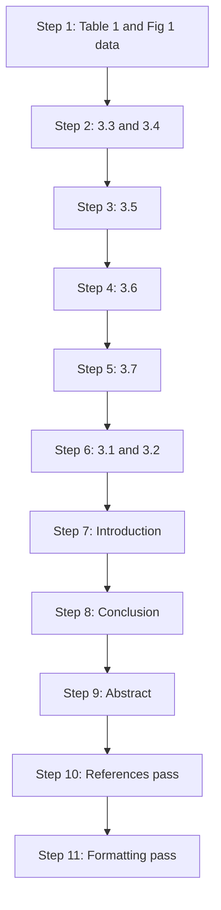

# Writing Plan — "Big Data with Machine Learning: A Review"

*Planning design document. Produced 2026-09-22 by an IDEA-EVALUATION + STRUCTURE-PLANNING subtask. Companion to [`notes/thesis-and-structure.md`](notes/thesis-and-structure.md). Scope: design only — no manuscript prose, no LaTeX, no `.bib`, no edits to `sources/`, `trackers/`, `paper/*.tex`, or `references.bib`.*

**Governing thesis (from the companion document):** *Across the 2025–2026 output of the four assignment journals, big-data machine learning has moved from learning on more data to learning under constraints — privacy, platform, and proof — and the corpus's own evidence shows those constraints, not accuracy, have become the binding limit.*

**Fixed component order (assignment, `notes/requirements.md` L32–39):** Abstract · Introduction · Literature Review · Tables and Figures · Conclusion · References.

---

## 1. Writing sequence

**Principle:** draft the *analysis* before the *frame*. The Literature Review defines the taxonomy, the claim ordering, and the citation numbers; the Abstract and Introduction are written once the argument is settled so they can **preview facts that already exist** instead of asserting facts the draft may not support. Abstract is drafted last; the References pass is last-but-one; formatting is the final pass. This preserves the outline's own order (`paper/outline.md` L48–50) and the assignment's 12-day target (freeze 2026-09-26, deadline 2026-09-27).



### Numbered step list

1. **Build the evidence artefacts first — Table 1 + Fig. 1.** Reconcile `results/table1.csv` against the 20 `sources/*.md` notes and the R1 master table; confirm the selection funnel numbers for Fig. 1 (1,519 → 441 → 49 → 20). Rationale: Table 1 is cited from §3.3 onward; building it first removes mid-draft data churn. *(No prose yet.)*
2. **Draft §3.3 (Scalable ML methods) and §3.4 (Platforms/pipelines) together.** They share the "resource over accuracy" argument and the resource/plumbing vocabulary; drafting them in one pass fixes the citation order for the first 9 numbers. Rationale: §3.3 and §3.4 are the method/infrastructure twin and are the least dependent on the other subsections.
3. **Draft §3.5 (Applications and domains).** Eight primary papers; heaviest subsection. Written third because it depends on §3.3's method names (JoBD-5, TBD-3 appear in both) for correct cross-referencing. Rationale: the "big data label loosens" finding (C-07) is best written once §3.3 has established the strict usage.
4. **Draft §3.6 (Cross-cutting analysis).** Written fourth because it *synthesises* §3.3–§3.5: the privacy–scale tension (C-15), the evaluation/reproducibility claim (C-06/C-19), and explainability (C-03) can only be stated after the individual sections exist. Rationale: this is the thesis's falsifiable half; it must follow the evidence sections.
5. **Draft §3.7 (Future directions).** Derived from §3.6 only. Rationale: every item must trace to a §3.6 observation (C-21, C-15, C-03), so it cannot precede §3.6.
6. **Draft §3.1 (Background) and §3.2 (Taxonomy/Fig. 2).** Written late because §3.1 needs to know what the synthesis actually assumed, and §3.2's caption needs the final paper ordering from steps 2–4. Rationale: the taxonomy is *retrospective* — it describes the structure §3.3–§3.6 already realised.
7. **Draft the Introduction.** Now that scope, the definitional pivot on "big data", the AIR exception statement, and the paper organisation are all settled. Rationale: the Introduction previews the settled argument; writing it earlier risks asserting a structure the draft did not take.
8. **Draft the Conclusion.** Recap + 2–3 takeaways + scope limits. Rationale: depends on every §3.x being final.
9. **Draft the Abstract (last).** One paragraph, no citations; can now summarise what exists. Rationale: assignment + AIR convention; abstract forecasts facts that must already be true.
10. **References pass.** Regenerate/verify the 20 Springer Basic entries against the canonical numbering; check every `[n]` resolves and no entry is uncited. Rationale: numbers are only final once the draft text is final.
11. **Formatting + compliance pass.** Apply the class line, section ordering, table/figure rules, and the compliance checklist in `notes/air-format-spec.md` §10. Rationale: formatting and references together are 5% of the grade; do them as a deliberate pass, not incidentally.

**Parallelisation note (8 members):** steps 2–3 can be split across theme leads (Methods lead, Applications lead) once step 1 is frozen; §3.6 and the Introduction are single-owner work (they need the whole corpus in view). The Abstract is one owner.

---

## 2. Per-section step specs

Each spec states the **paragraph-by-paragraph job** and the **evidence/claims** it draws on. Claim IDs refer to the R2 ledger in [`trackers/paper-tracker.md`](trackers/paper-tracker.md); paper IDs refer to the corpus. The rule from the R2 ledger applies throughout: **abstract-level backing is fine for a description, never for a number.**

### 2.1 Abstract — Component 1 (2%, ~200–250 words, write last)

| Para | Job | Evidence |
|---|---|---|
| A1 | State why BD+ML needs a current synthesis (data growth + fast-moving literature). | `notes/requirements.md` L9; landscape §1 |
| A2 | State what was reviewed: 20 papers, 4 journals, 2025–2027 window, selection method. | tracker Summary ("The corpus"); Fig. 1 funnel |
| A3 | State the taxonomy/themes found (five branches; constraint thesis). | T1; B1–B5 branch map |
| A4 | State 2–3 cross-cutting insights (privacy–scale tension; evaluation fragmentation; explainability unsolved). | C-15, C-06, C-03 |
| A5 | State gaps + future directions in one sentence each. | C-21; §3.7 |

**Constraint:** no citations, no subheadings, no equations (AIR convention; `notes/air-format-spec.md` §7).

### 2.2 Introduction — Component 2 (3%, ~1.5–2 pages)

| Para | Job | Evidence |
|---|---|---|
| I1 (Context) | Explosive data growth; ML as the primary lens for extracting value; why the 2025+ literature needs consolidating. | landscape §1 |
| I2 (Term pivot) | Introduce and immediately problematise "big data": in this corpus it denotes heterogeneity and constraint more than volume. | C-07, C-13; T3 device |
| I3 (Scope) | Four journals, 2025–2027 window, 20 papers (5 per journal), selection criteria (joint BD+ML relevance, theme diversity, impact, access). | `notes/requirements.md` L15–30; landscape §2 |
| I4 (Method + Fig. 1) | Programmatic retrieval → keyword screen → Crossref verification → inclusion; reference Fig. 1. | tracker Summary funnel; Fig. 1 |
| I5 (Exception) | State the AIR review-article exception openly and name the insurance set. | `notes/requirements.md` L24; F1 mitigation |
| I6 (Organisation) | Preview the six components and the §3.x structure. | `paper/outline.md` |

**Constraint:** no subheadings in the Introduction (`notes/air-format-spec.md` §3.1). **Numbering rule for this section: the Introduction cites no individual pool papers** — this keeps the first-appearance citation order deterministic (see §3). *(Alternative: if the team prefers an early preview, cite exactly the two reviews AIR-3 and AIR-5 in I3 in that order; that would renumber the whole list. The plan below assumes the no-citation rule.)*

### 2.3 Literature Review — Component 3 (10%)

#### §3.1 Background & concepts (1–2 paragraphs)
| Para | Job | Evidence |
|---|---|---|
| B1 | Define only what the synthesis needs: the "V"s of big data, and the ML pipeline at scale. | landscape §3 |
| B2 | State the definitional pivot explicitly, so the reader meets "big data" with the corpus's meaning. | C-07, C-13 |

#### §3.2 Taxonomy (Fig. 2)
| Para | Job | Evidence |
|---|---|---|
| T1 | Propose Axis 1 (what is learned) and Axis 2 (what surrounds the learning). | landscape §3 |
| T2 | Introduce branches B1–B5, state each paper sits in exactly one branch, and that the taxonomy drives §3.3–§3.6. | tracker "What the 20 papers cover"; Fig. 2 |
| T3 | State the curation caveat (theme proportions are curated, not raw field proportions) and list the empty cells (no RL-at-scale; no purely theoretical work; no 2027 item). | landscape §2, §3; C-21 |

#### §3.3 Scalable ML methods & architectures — primary papers: TBD-4 [1], TBD-5 [2], JoBD-5 [3], BDR-5 [4], TBD-1 [5], AIR-3 [6]
| Para | Job | Evidence |
|---|---|---|
| M1 | Open with the branch's claim: scaling is now plumbing-heavy — parallelisation, embeddings, streaming constraints rather than new base algorithms. | landscape §4; T1 |
| M2 | The deep time-series route: KATN's local+global aggregation. | TBD-4 [1]; C-12 |
| M3 | The streaming counterpoint: detection without offline retraining (GSTrees/GWAAE). | TBD-5 [2]; C-10 |
| M4 | The structural constraint: hyperbolic (Poincaré-ball) embedding for sparse graphs — and its own admitted overhead. | JoBD-5 [3]; C-08 |
| M5 | The classical counterpoint: scaling least squares (spectral embedding + random Fourier features). **Describe at title level only — no numbers.** | BDR-5 [4]; C-20, C-13 |
| M6 | Explanation cost as a scalability bottleneck; parallel tree explainer. **Description only, no metrics.** | TBD-1 [5]; C-03 |
| M7 | The method arc that frames the section and the paper: classical → deep → foundation models. | AIR-3 [6]; C-01, C-02 |
| M8 | Close with the pattern: four of five research papers optimise a resource, not an accuracy leaderboard. | landscape §4; T1 |

#### §3.4 Platforms, pipelines & data engineering — primary papers: BDR-2 [7], BDR-3 [8], JoBD-4 [9]
| Para | Job | Evidence |
|---|---|---|
| P1 | Frame the branch: it optimises the machinery under the models and most literally embodies "big data". | landscape §5 |
| P2 | The cluster-engine layer (Spark). **Title-level description only.** | BDR-3 [8]; C-05, C-14 |
| P3 | The fog/cloud streaming layer: Kafka → Spark Streaming → fog/cloud, offline-to-online split. | JoBD-4 [9]; C-05 |
| P4 | The distributed-training economics layer: FL cost in time, communication, energy. | BDR-2 [7]; C-04, C-16 |
| P5 | Close: the three layers form an infrastructure stack no single application paper deploys end-to-end; and real-time is evaluated architecturally, not by measured operational latency. | C-05, C-13 |

#### §3.5 Applications & domains — primary papers: BDR-1 [10], AIR-2 [11], BDR-4 [12], JoBD-1 [13], JoBD-3 [14], TBD-2 [15], TBD-3 [16], AIR-1 [17]
| Para | Job | Evidence |
|---|---|---|
| A1 | Open: the domains are far apart; where native graph/stream structure exists, most method-building happens. | landscape §6 |
| A2 | Security/traffic detection vertical: graph-reduction + GNN explainability in malware analysis. | BDR-1 [10]; C-03, C-08 |
| A3 | The survey counterpart on the same vertical: rule-based → deep learning for telecom. | AIR-2 [11]; C-10, C-18 |
| A4 | Finance: graph learning on natively relational company data. **Title-level description only.** | BDR-4 [12]; C-08 |
| A5 | Agriculture: image-volume "big data" on a single GPU — the clearest case where the label loosens. | JoBD-1 [13]; C-07, C-20 |
| A6 | Affective computing: multimodal variety + prompt engineering; flag the anomalously high numbers as a reporting concern, not capability. | JoBD-3 [14]; C-09, C-11 |
| A7 | Foundation-model/agentic applications: industrial multimodal LLM and LLM graph reasoning. **Description only** (paywalled, abstract-level). | TBD-2 [15], TBD-3 [16]; C-01, C-16 |
| A8 | The domain divide as the section's hinge, plus the observation that agentic/foundation-model work is ahead of its big-data grounding. | AIR-1 [17] (p.24 quote); landscape §7 |
| A9 | Close: security/anomaly detection is the single most-represented domain in the corpus. | C-18 |

#### §3.6 Cross-cutting analysis & evaluation — primary papers: JoBD-2 [18], AIR-4 [19], AIR-5 [20] (+ AIR-2 [11] cross-ref)
| Para | Job | Evidence |
|---|---|---|
| X1 | Frame: the governance concentration is about everything around the model — visibility, publication, trust. | landscape §8 |
| X2 | Tension 1 — privacy-preserving vs scale-maximizing: the corpus's defining contradiction; DP's accuracy cost; JoBD-4 defers privacy. | C-15; JoBD-2 [18], AIR-4 [19]; (JoBD-4 [9] cross-ref) |
| X3 | The privacy mechanism itself: adaptive federated aggregation and its privacy–utility trade-off. | JoBD-2 [18]; C-04 |
| X4 | Synthetic data as the second mechanism, and the finding that fidelity metrics do not track usefulness. | AIR-4 [19]; C-19 |
| X5 | Tension 2 — evaluation fragmentation: the corpus's only audit shows single-run estimates overstate stability. | AIR-5 [20]; C-06 |
| X6 | Explainability as a recurring, largely unsolved requirement; deployment cost rather than accuracy as the operational blocker. | C-03, C-16; AIR-2 [11] cross-ref |
| X7 | Structural findings: inaccessible part of the record; no RL-at-scale; no purely theoretical work; scalability claims often architectural. | C-14, C-21, C-13 |

#### §3.7 Future directions
| Para | Job | Evidence |
|---|---|---|
| F1 | RL at scale is absent from the taxonomy — an empty method cell. | C-21 |
| F2 | Agentic systems lack big-data grounding (no streaming/cluster/memory evaluation). | landscape §10; AIR-1 [17] |
| F3 | The privacy–scale contradiction is unpriced beyond BDR-2's cost accounting. | C-15; BDR-2 [7] |
| F4 | Accountability lags mechanism: one audit against three privacy works. | AIR-5 [20], JoBD-2 [18], AIR-4 [19] |
| F5 | Explanation at scale is single-sourced. | C-03; TBD-1 [5], BDR-1 [10] |

### 2.4 Tables and Figures — Component 4 (3%)
| Item | Job | Evidence |
|---|---|---|
| Table 1 | Master comparison of the 20 papers: ref no., journal, year, domain, ML technique(s), big-data platform/tech, dataset & scale, key contribution. Backbone table. | `results/table1.csv`; R1 master table |
| Table 2 | Branch × paper matrix (B1–B5 × the 20 IDs). | tracker branch map |
| Fig. 1 | PRISMA-style selection flow (identification → screening → inclusion). | tracker Summary funnel |
| Fig. 2 | Taxonomy diagram (Axis 1 × Axis 2; five branches). | landscape §3 |
| Fig. 3 | Distribution chart (papers per journal / year / theme; or per ML paradigm). | tracker Summary; landscape §3 |
Every item numbered, captioned, and cited from the text (Table~1, Figure~2) per `notes/air-format-spec.md` §3.7/§4.

### 2.5 Conclusion — Component 5 (2%, ~1 page)
| Para | Job | Evidence |
|---|---|---|
| C1 | Recap what the synthesis showed (state of methods, platforms, applications, challenges). | T1 |
| C2 | 2–3 takeaways: constraint over volume; privacy–scale collision; evaluation as the weakest joint. | landscape §11 |
| C3 | Limits of our review: 4 journals, 20 papers, 2025–2026 only, English-language venues, curated theme mix. | landscape §2, §11 |
| C4 | Outlook, no new citations. | §3.7 (cross-ref) |

### 2.6 References — Component 6 (3%)
| Job | Evidence |
|---|---|
| Regenerate/verify 20 Springer Basic entries in canonical order; every `[n]` resolves; no uncited entry. | tracker Appendix A (BibTeX) + Appendix B (Springer Basic strings) |

---

## 3. Citation order and reference structure

### 3.1 Canonical citation scheme (fixed by the assignment)

- **Style:** Springer Basic, **numeric, brackets** — in text `[1]`, `[1, 2]`, `[1–3]` (`notes/requirements.md` L42; `notes/air-format-spec.md` §1). Class line: `\documentclass[pdflatex,sn-basic,Numbered]{sn-jnl}`.
- **Ordering rule:** entries are numbered **by order of first appearance in the running text**. The order below is produced by the section outline in [`notes/thesis-and-structure.md`](notes/thesis-and-structure.md) **under the no-citation-rule for the Introduction and §3.1–§3.2** (first citation occurs in §3.3). If that rule changes, this table is re-derived mechanically.
- **Count:** **20 references** (the 20 primary papers). Supporting/background references are deliberately kept minimal; the assignment grades the 20.
- **Compression:** consecutive numbers collapse to ranges (`[1–3]`); non-consecutive pairs stay separate (`[1, 5]`).

### 3.2 Canonical paper → citation-number plan

| Citation no. | Paper ID | First appears in | Short ref | `.bib` key |
|---|---|---|---|---|
| [1] | TBD-4 | §3.3 | Xiao et al., KATN, IEEE TBD 2025 | `xiao2025katn` |
| [2] | TBD-5 | §3.3 | Gunbilek et al., streaming anomaly detection, IEEE TBD 2026 | `gunbilek2026enhanced` |
| [3] | JoBD-5 | §3.3 | Zhang et al., graph GNN anomaly detection, JoBD 2025 | `zhang2025graph` |
| [4] | BDR-5 | §3.3 | Li & Liu, large-scale least squares, BDR 2026 | `li2026large` |
| [5] | TBD-1 | §3.3 | Jiang et al., PEXP, IEEE TBD 2026 | `jiang2026pexp` |
| [6] | AIR-3 | §3.3 | Muneer et al., multimodal cancer FMs, AIR 2026 | `muneer2026classical` |
| [7] | BDR-2 | §3.4 | Teixeira et al., FL cost analysis, BDR 2025 | `teixeira2025efficient` |
| [8] | BDR-3 | §3.4 | Ghodsi & Moeini, opinion fraud by Spark, BDR 2026 | `ghodsi2026opinion` |
| [9] | JoBD-4 | §3.4 | Saleh et al., cloud real-time SBP/HR TCN+Spark, JoBD 2025 | `saleh2025cloud` |
| [10] | BDR-1 | §3.5 | Mohammadian et al., explainable malware detection, BDR 2025 | `mohammadian2025explainable` |
| [11] | AIR-2 | §3.5 | Edozie et al., telecom anomaly detection, AIR 2025 | `edozie2025telecom` |
| [12] | BDR-4 | §3.5 | Liu et al., heterogeneous graph risk assessment, BDR 2026 | `liu2026heterogeneous` |
| [13] | JoBD-1 | §3.5 | Elfouly et al., plant disease detection, JoBD 2025 | `elfouly2025deep` |
| [14] | JoBD-3 | §3.5 | Wafa et al., multimodal emotion recognition, JoBD 2025 | `wafa2025advancing` |
| [15] | TBD-2 | §3.5 | Wang et al., TS-MLLM, IEEE TBD 2026 | `wang2026mllm` |
| [16] | TBD-3 | §3.5 | Chai et al., GraphLLM, IEEE TBD 2025 | `chai2025graphllm` |
| [17] | AIR-1 | §3.5 | Abou Ali et al., Agentic AI survey, AIR 2025 | `abouali2025agentic` |
| [18] | JoBD-2 | §3.6 | Haripriya et al., privacy-enhanced FL, JoBD 2025 | `haripriya2025privacy` |
| [19] | AIR-4 | §3.6 | Waseem et al., generative AI synthetic data, AIR 2025 | `waseem2025synthetic` |
| [20] | AIR-5 | §3.6 | Vats et al., deep MTS survey + audit, AIR 2026 | `vats2026survey` |

**Resulting in-text runs of note:** §3.3 will read `[1–6]` when summarising the branch and cite individually within it; §3.4 uses `[7–9]`; §3.6 uses `[18–20]`. Because the order is contiguous by section, compression is natural and few non-consecutive pairs occur.

### 3.3 `.bib` key naming convention

**Convention:** `firstauthorlastnameYYYYkeyword` — lowercase, no separators, first author's family name + 4-digit year + a short lowercase keyword. This **matches the keys already present in `paper/references.bib`** (tracker Appendix A), so no renaming is required and the existing file stays authoritative. Compound/particle surnames are flagged in the tracker for manual verification.

**Key list (verbatim from the tracker; do not rename):** `xiao2025katn`, `gunbilek2026enhanced`, `zhang2025graph`, `li2026large`, `jiang2026pexp`, `muneer2026classical`, `teixeira2025efficient`, `ghodsi2026opinion`, `saleh2025cloud`, `mohammadian2025explainable`, `edozie2025telecom`, `liu2026heterogeneous`, `elfouly2025deep`, `wafa2025advancing`, `wang2026mllm`, `chai2025graphllm`, `abouali2025agentic`, `haripriya2025privacy`, `waseem2025synthetic`, `vats2026survey`.

### 3.4 Reference entry template (Springer Basic — use verbatim when `references.bib` is populated later)

**Template:**
```
Lastname FN (Year) Article title. Journal Volume(Issue):pages
```
(with `https://doi.org/...` appended where available; multiple authors separated by commas, "and" before the last if the house style requires; page ranges use an en dash). This matches `notes/requirements.md` L42 and the tracker's Appendix B strings.

**Worked examples (verbatim from tracker Appendix B — the references lead's checklist):**
```
Xiao Z, Xing H, Qu R, Li H, Tong H, Luo S (2025) Knowledge Aggregation Transformer Network for Multivariate Time Series Classification. IEEE Transactions on Big Data 11(6):3413–3429. https://doi.org/10.1109/tbdata.2025.3594294
Mohammadian H, Higgins G, Ansong S, Razavi‐Far R, Ghorbani AA (2025) Explainable malware detection through integrated graph reduction and learning techniques. Big Data Research 41:100555. https://doi.org/10.1016/j.bdr.2025.100555
Edozie E, Shuaibu AN, Sadiq BO, John UK (2025) Artificial intelligence advances in anomaly detection for telecom networks. Artificial Intelligence Review 58(4) [article no. to verify]. https://doi.org/10.1007/s10462-025-11108-x
```
**Flags carried from the tracker (resolve during the references pass, do NOT edit this plan):** open-access JoBD items need article numbers; online-first IEEE/AIR items need volume/pages; compound surnames parsed mechanically need verification (TBD-1, TBD-5, JoBD-3, AIR-1, AIR-4).

---

## 4. §3.x → Tables/Figures and citation-number map

| §3.x | Primary papers (citation no.) | Tables / Figures it must cite | Notes for the figure-designer step |
|---|---|---|---|
| §3.1 Background | — | none | pure prose |
| §3.2 Taxonomy | — (all 20 placed visually) | **Fig. 2** (taxonomy), **Table 2** (branch × paper) | Fig. 2 must show B1–B5 and place all 20; caption lists papers in citation order for determinism |
| §3.3 Methods | TBD-4 [1], TBD-5 [2], JoBD-5 [3], BDR-5 [4], TBD-1 [5], AIR-3 [6] | **Table 1**, **Fig. 3** (methods/paradigm distribution) | a methods-axis chart (paradigm × scale lever) helps; TBD-4/5 and JoBD-5 can carry numbers, BDR-5/TBD-1 must not |
| §3.4 Platforms | BDR-2 [7], BDR-3 [8], JoBD-4 [9] | **Table 1** | an infrastructure-stack schematic (cluster → streaming → distributed-training economics) is a candidate Fig. 3 variant |
| §3.5 Applications | BDR-1 [10], AIR-2 [11], BDR-4 [12], JoBD-1 [13], JoBD-3 [14], TBD-2 [15], TBD-3 [16], AIR-1 [17] | **Table 1**, **Fig. 3** (domain distribution) | a domain-coverage chart; mark the six-paper paywalled/thin cluster explicitly |
| §3.6 Cross-cutting | JoBD-2 [18], AIR-4 [19], AIR-5 [20] (+ AIR-2 [11]) | **Table 2** | no new figure required; Table 2 can carry a governance/evaluation column |
| §3.7 Future | — (pulls AIR-1 [17], C-21) | none | prose |
| §4 T&F component | all 20 referenced | **Table 1, Table 2, Fig. 1, Fig. 2, Fig. 3** | every item must be cited from the text |
| §2 Introduction | none individual (Fig. 1 only) | **Fig. 1** | selection-flow figure; keep funnel numbers consistent with tracker Summary |
| §5 Conclusion | none new | none | no new citations |

**Consistency checks:** (a) Table 1's `ref` column must use the canonical citation numbers above, not pool IDs; (b) Fig. 2's caption must place all 20 exactly once; (c) every figure/table name appears in the running text.

---

## 5. Risk list for the writing stage

| # | Risk | Where it bites | Mitigation |
|---|---|---|---|
| R1 | **AIR review-article exception rejected by supervisor.** | §3.3, §3.5, §3.6 lose anchors; §3.6's evaluative half (AIR-4, AIR-5) is the worst hit — no alternate is described as an audit. | Confirm with the supervisor before drafting §3.6; if rejected, promote AIR-A6…A10 and re-derive branch balance; state the change in the tracker revision log (not in this plan). |
| R2 | **No abstract for BDR-3/4/5; 4 TBD papers paywalled.** | §3.3 (BDR-5, TBD-1), §3.4 (BDR-3), §3.5 (BDR-4, TBD-2, TBD-3). | Write descriptions only; attach numbers only after full-text retrieval; rely on C-13/C-14 as the honest statement of the limit. Use designated OA swaps only if access fails. |
| R3 | **Quoting anomalously high numbers as SOTA** (JoBD-3 99.82%, TBD-5 ">94%"). | §3.5, §3.6. | Cite C-09; frame them as reporting-practice evidence; verify before any capability claim. |
| R4 | **"Big data" ambiguity unresolved.** | §3.1, §3.5. | Enforce the definitional pivot in §3.1; keep the strict usage in §3.3 and the loosened usage labelled in §3.5. |
| R5 | **Overclaiming absence** (RL, privacy–scale) as field-level findings. | §3.6, §3.7. | Always scope to "no selected paper" / "across these 20 verified papers"; cite C-21. |
| R6 | **Citation-number drift** — pool-ID numbering (`[1]`=TBD-1) leaks in from `notes/landscape-report.md` and `results/table1.csv`. | whole draft. | Re-key every `[n]` to the canonical scheme in §3.2 at assembly; keep Table 1's `ref` column numeric-canonical; reference manager keyed by `.bib` key, not pool ID. |
| R7 | **Reviews cited for numbers** (second-hand figures). | §3.3–§3.6. | Never quote a number from AIR-1..AIR-5; use research full texts only; AIR-5 is cited for its own audit findings, not others' numbers. |
| R8 | **Abstract written early** and asserting unsupported facts. | Component 1. | Sequence discipline (§1 step 9): Abstract last; no citations. |
| R9 | **Figures/tables uncited or duplicated** (marks lost on the 3% component). | Component 4. | Run the consistency checks in §4 before the formatting pass. |
| R10 | **Formatting/class-line mismatch** (`sn-mathphys-num` default vs required `sn-basic`). | whole draft. | Set `\documentclass[pdflatex,sn-basic,Numbered]{sn-jnl}` from the first compile; run the checklist in `notes/air-format-spec.md` §10. |
| R11 | **Deadline compression** (freeze 2026-09-26). | whole draft. | Parallelise §3.3/§3.4/§3.5 across theme leads per §1; §3.6 + Intro single-owner; Abstract single-owner. |
| R12 | **2027 window unpopulated** (no 2027-dated item exists). | Introduction scope. | State the availability check explicitly in the methodology sentence (landscape §2). |
